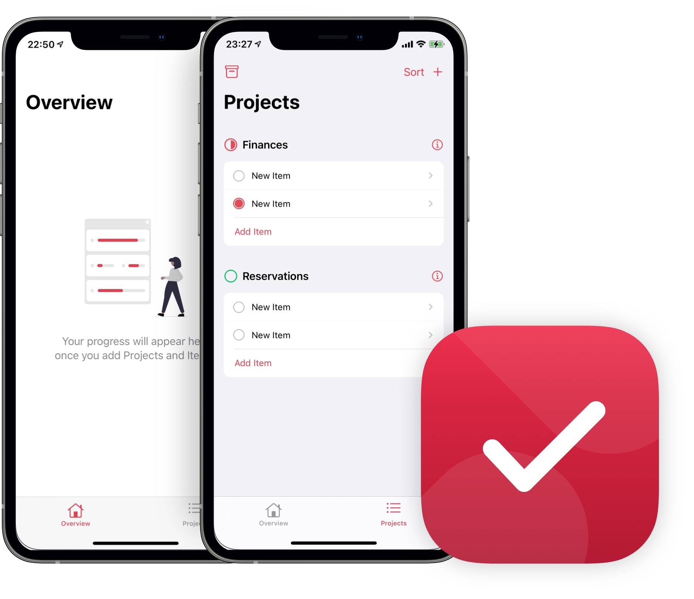

# Taskable

Taskable helps people keep track of projects and goals. The Overview tab gives them a glance of their overall progress and high priorities. Built purely in SwifUI using CoreData. This is an ongoing project and will receive improvements regularly. 

## Introduction

This app was initially created following the UltimatePortfolio App by Paul Hudson @[Hacking With Swift](https://www.hackingwithswift.com) and then I've added a few extra features and changed the original design.

It's currently available on Testflight getting tested by a number of people. [Reach Out]() if you'd like to test it. Please bear in mind it's not a finished product and I'll submiting regular updates. You might encounter a bug occasionally but the app can used without any limitations.

## My Goal

Being a store manager my incentive was to create an app that could make manager's life easier and by creating Taskable I was able to practice as much Swift as I could and have a project ready to get my first iOS developer job and do a career change. 

I wanted to practice passing data through views, explore different and multiple designs and use CoreData.

## Technologies

* SwiftUI
* CoreData

Version 0.1.0 (2) | Version 0.1.0 (3) 
------------ | -------------
Add Projects | Tap circle to mark as completed
Add Items to a project | Updates Project header design
Change project color | Color added to Project Header
Track completion progress | Access your projects from the Overview Tab
Archive and/ or delete | Textfields use improved -  A "x" was added to delete the entire text in one go, rather than using the keyboard. 
Check archived projects | Bug fixes
Add project and/or item descriptions |
Set priority |
Overview Tab |
Sort by Creation Date and Title

*Currently working on / Ideas and feedback from users*
* Bug fixes
* Notifications
* Choose date
* iCloud Integration
* Core Haptics

## Contact

Please Visit http://www.ruisilva.xyz to reach out.
